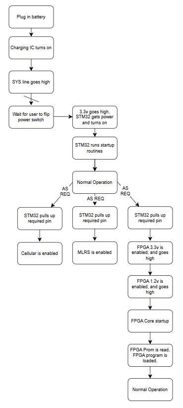

# MONAD architecture

This document condenses the recovered MONAD material into a system-level view. It distinguishes intended behavior from verified performance and avoids treating the preliminary datasheet as a fabrication release.

## Design intent

MONAD was conceived as a reusable flight-computer platform for Project STORM and later ANU Rocketry payloads. The board concentrated the compute, sensing, logging, communications, charging, and thermal-management interfaces that otherwise required several separate controllers.

The main architectural choices were:

1. Split general supervision from high-throughput or timing-sensitive work.
2. Power high-consumption subsystems only when requested.
3. Expose both MCU and FPGA interfaces for vehicle-specific peripherals.
4. Use replaceable radio/cellular modules where RF integration risk was high.
5. Retain multiple storage and communications paths for operational flexibility.

## Compute domains

### STM32F405 supervisory domain

The STM32F405 was intended to be the first programmable device enabled during startup. Its responsibilities included:

- system initialization and rail sequencing;
- inertial, barometric, and temperature-sensor acquisition;
- microSD logging;
- coordination of the cellular/GNSS and mLRS links;
- battery, charger, heater, buzzer, and fan control;
- command and status exchange with the FPGA; and
- general-purpose peripheral control through the expansion connector.

### Spartan-6 reconfigurable domain

The Xilinx Spartan-6 domain was intended for work that benefited from deterministic parallel logic:

- OV7670 camera capture and early-stage image/video processing;
- high-speed or parallel external interfaces;
- data buffering and packet-oriented utilities;
- shared UART/I2C communication with the STM32; and
- selected redundant control functions.

The older revision used a BGA Spartan-6 and external application RAM. Later cost-reduction work moved to a QFP-packaged device and revised the surrounding implementation. The archived preliminary datasheet is weighted toward the older revision.

## Sensors and storage

The documented onboard sensor suite consists of:

- **ICM-20948** 9-axis inertial measurement unit (cut in final version);
- **BMP580** barometric pressure sensor; and
- multiple **TMP102** temperature sensors positioned near major thermal zones.

The design also included two microSD interfaces. One was directly associated with the supervisory domain and the other provided additional storage capability for the FPGA-side data path.

## Communications

### Long-range telemetry

A Matek MR900 module provided an 868/915 MHz mLRS link. The module is based on an STM32 and SX1262 radio and advertises up to 30 dBm output. Range figures in recovered notes were design targets, not demonstrated MONAD results.

### Cellular and positioning

A Quectel BG95-M3 Mini PCIe module was selected for LTE Cat M1/NB2 connectivity and GNSS positioning. A module was preferred over a board-level RF design to reduce certification and RF-layout risk.

### Camera

An OV7670 VGA sensor connected to the FPGA through a parallel pixel interface and SCCB/I2C-style control interface. Recovered notes proposed low-frame-rate image transmission; this remained a design objective rather than a verified end-to-end capability.

## Power architecture

The recovered design uses a single-cell battery system with charging available while the main compute rails are off. Its sequencing concept is:

1. The battery is connected and the charging/system controller remains available.
2. A deliberate user action requests system power.
3. The 3.3 V supervisory rail enables and the STM32 starts.
4. The STM32 completes initialization.
5. Cellular, mLRS, and FPGA rails are enabled independently when required.
6. FPGA 3.3 V is established before its lower-voltage core rail and configuration sequence.

The board also provided:

- external charging input intended to support solar charging;
- switchable 3.3 V and 5 V domains;
- a battery-heater output;
- charger, power-supply, and radio fan controls; and
- distributed temperature monitoring.

## External interfaces

The expansion connector exposed a mixture of:

- FPGA GPIO;
- STM32 GPIO and analog-capable pins;
- STM32 UART transmit/receive;
- shared I2C clock/data;
- system 5 V and switched/unswitched 3.3 V rails;
- external charge input; and
- grounds and negotiation/control signals.

See the [project-specific datasheet extract](MONAD-project-extract.pdf) for the recovered pin tables. Those tables are preliminary and should be checked against native CAD before any hardware reuse.
